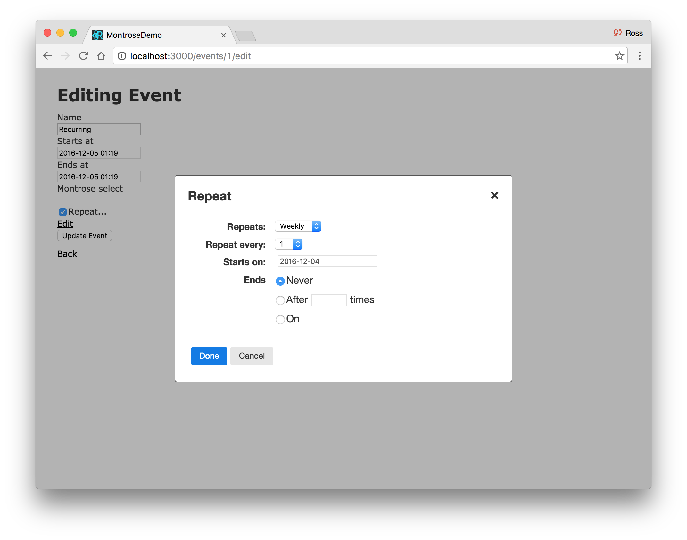

# montrose-select

A javascript menu for selecting event recurrence.

Integrates with the [`montrose`](https://github.com/rossta/montrose) ruby gem
through the [`montrose-rails`](https://github.com/rossta/montrose-rails) Rails
engine for handling event recurrences on the backend.



## Installation

Via NPM

```ruby
npm install montrose-select
```

Or in the browser

```javascript
<script src="https://unpkg.com/montrose-select"></script>
```

## Usage

Given a form:

```html
<form>
  <label data-recurrence="label">Repeats on</label>
  <input data-recurrence="input" type="hidden" name="recurrence">
</form>
```

```javascript
import MontroseSelect from 'montrose-select'

new MontroseSelect({
  target: document.querySelector('[data-recurrence="label"]'), // Replaces targeted DOM element

  recurrence: null,                                            // initial recurrence value

  onChange: (recurrence) => {                                  // Callback when recurrence changes
    console.log('Recurrence changed', recurrence)
  },

  onFinish: (recurrence) => {                                  // Callback when recurrence editing is "done"
    document.querySelector('[data-recurrence="input"]').value = JSON.stringify(recurrence)
  },
})
```

The recurrence is a JavaScript object with the following properties:

```javascript
{
  frequency: 'day',      // | 'week' | 'month' | 'year'; specifies units, required,
  interval: 2,           // any integer; specify unit count; optional; defaults to 1
  starts: '2016-12-01',  // an ISO-string or Date object; when recurrence starts; optional
  until: '2016-12-31',   // same as 'starts'; when recurrence ends by date; optional
  total: 10,             // instead of 'until'; when recurrence ends by count; optional
}
```

## Contributing

Bug reports and pull requests are welcome on GitHub at https://github.com/rossta/montrose-select. This project is intended to be a safe, welcoming space for collaboration, and contributors are expected to adhere to the [Contributor Covenant](http://contributor-covenant.org) code of conduct.

## License

The gem is available as open source under the terms of the [MIT License](http://opensource.org/licenses/MIT).

